# Final Project Proposal: Data Science Job Market Visualizer

**GitHub Repo URL**: https://github.com/CMU-IDS-2022/final-project-thescientists

**Team**: Sushanth Reddy (syellare), Nikita Jyoti (njyoti), Kriti Anant (kanant), Shreya Bedi (shreyabe)

The Data Science profession has seen phenomenal growth in recent years. As data collection and retrieval technologies improve, multiple industries ranging from healthcare to telecommunications have increased the sophistication of their data operations. Now, they are on the lookout for talent capable of processing the mountains of data to gain an edge over their competitors. With so many job opportunities opening up, one is bound to be confused about which role suits their career goals and skill set. 

As college graduates who aspire to be Data Scientists, we would like to understand the Data Science job market deeper than the superficial details provided by news articles and forecasts. Often job seekers apply for Data Science job roles based on information found from online sources and their professional networks. This might result in them losing out on their deserved pay or choosing a job location with a salary that doesn't match the cost of living for the city. We hope to solve this problem by building an interactive dashboard that can help a Data Science aspirant analyze the U.S. job market and discover roles matching their technical skillset, professional experience, and desired compensation.

## Proposed solution

For our final project, we would like to analyze data from well-known networking and job search portals such as LinkedIn, Indeed, and Glassdoor to get insights into the extent of data science hiring in the U.S. Our proposed interactive visualizations will help us answer questions like…

* Which states and cities have the most Data Science job openings ?

* Differences in salaries between Data Science, Data Engineer and Data analyst positions.

* Which industries and companies are actively hiring for data science roles in the U.S.?

* How do Data Science salaries vary with company size and industry ?

* How do Data Science Salaries compare across locations (cost of living wise) ?

* Which Industries/Companies offer the most lucrative Data Science jobs ?

* According to a company's job description, what are the recruiters looking for in a Data Science hire?

……and many more.

## Datasets

To build our interactive visualization, we will rely on the below datasets created by web scraping job listings from Glassdoor and Indeed. Our interactive visualizations on the above questions would help Data Science aspirants scout the U.S. job market and enable them to find the best job opportunities. We also plan to build a personalized job recommendation feature in our application that can analyze the user's skills, professional experience, location, and salary preferences and suggest roles satisfying their requirements. This application has the potential to guide Data Science aspirants towards applying fulfilling jobs and ensure a satisfying professional work experience.

[Data Analyst Jobs](https://www.kaggle.com/datasets/andrewmvd/data-analyst-jobs)

[Data scientist salary](https://www.kaggle.com/datasets/nikhilbhathi/data-scientist-salary-us-glassdoor)

[Glassdoor Job Postings : Data Science](https://www.kaggle.com/atharvap329/glassdoor-data-science-job-data)

## Sketches and Data Analysis

The datasets required for our final projects have been web scrapped from the Online Job review site Glassdoor and uploaded to Kaggle for public use. The datasets are decently cleaned and thus are ready to be analyzed for implementing our visualizations without requiring much cleanup.

To provide a streamlined flow of information for our application users, we would like to divide our project into three separate visualization dashboards, each covering a topic of interest for a Data Science job hunter.

#### US Data Science Jobs visualizations

* **US State wise Number of Data Science Roles**

This visualization shows the number of jobs available in various states in the United States. Users will have the ability to interact with the chart. They will be able to see a specific location and understand the job opportunities available.

**Interactivity:** 
  1. Users can select a specific location where they want to target and see what job opportunities are available there.

  1. Users can also select a year to observe how many job opportunities were available that year and help them analyze if demand for the job role is growing in a particular region.
  
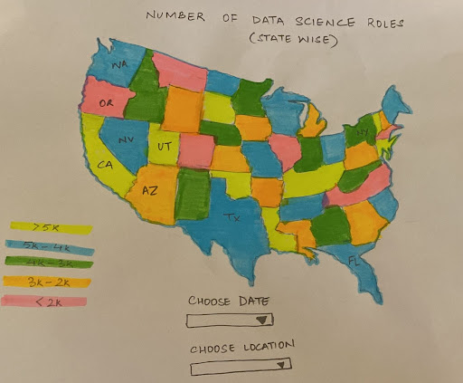
  
**Data Analysis:** We can use the below filtered data for creating altair visualizations

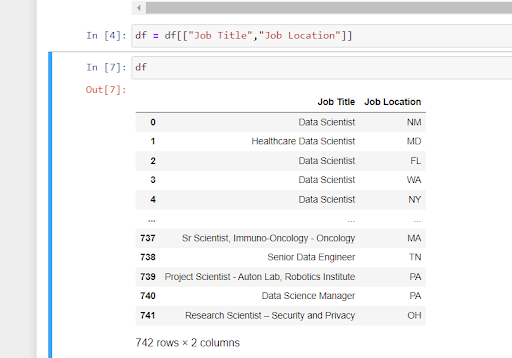

In order to get the exact date when the job was posted, we will be using the following data:

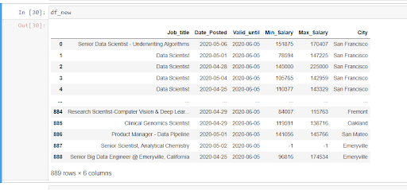

* **State-wise Average, Min, Max Salaries for Data roles**

This visualization shows the minimum, maximum and average salaries for various states in the United States.

**Interactivity:**
  1. Choosing one of the options - minimum salary for all the states, maximum salary for all the states and average salary for all the states.
  1.Colors will change depending on where the highest (minimum/maximum/average) salary is.

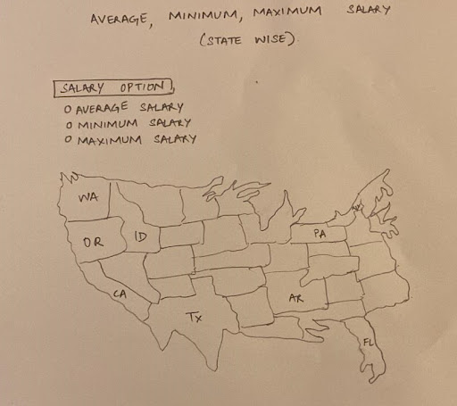

**Data Analysis:**
We can use the below filtered data to create the altair charts

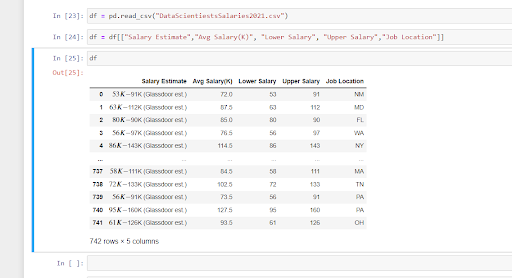

* **Salaries Normalized by Cost of Living**

This visualization will take the user's state and current salary as inputs and display the salary normalized by cost of living. Ex- $80,000 Data Scientist Salary is equivalent to $123,000 pay in California. This US state-wide comparision will help users make better decisions when comparing pays across states and choose the one with most beneficial pay terms.

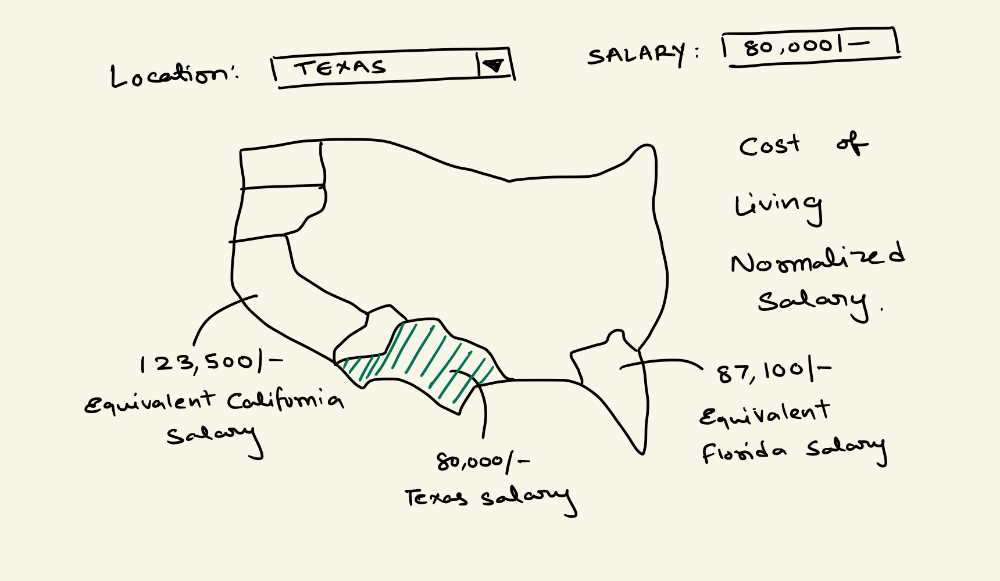

**Data Analysis:**
We have extracted Cost of living Index from the [Missouri Economic Research and Information Center](https://meric.mo.gov/data/cost-living-data-series) 

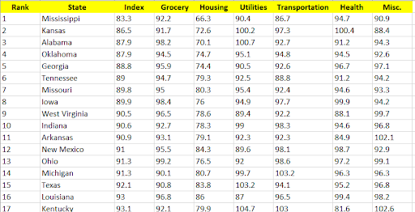

 

**Industry and Company level visualizations**

* **Average, Min and Max salaries by Industry for Data roles**

This bar graph shows the average salary offered by various industries for data related roles. These roles include data engineer, data analyst and data scientist. The y-axis represents salaries in a magnitude of 1000s while industries are plotted on the x-axis with each bar representing a type of role.

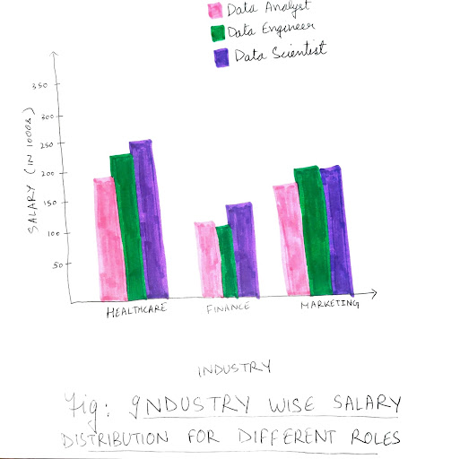

This visualization shows the average salary offered by different industries/companies for data roles in general. This is linked with the previous graph – the user can infer the average for specific positions per industry in the bar chart, select the industry they want to work in, and look at specific companies in that domain for salary comparison. The higher the salary, the bigger the size of the bubble and the darker its shade. A tooltip will show the industry (or company) name and the salary offered upon hovering over any bubble.

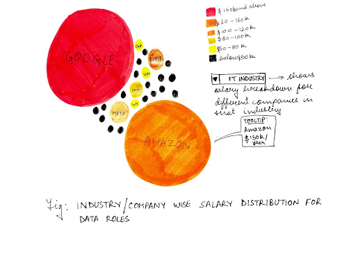

* **Company Ratings by Employees**

Is it a good company to work at? How is the company culture? Do employees like working there? 

Below visualization shows bubbles of 3 colors to depict company glassdoor ratings  (out of 5) classified into three categories. 4-5 stars are in the Good category, 3 stars are in the Satisfied category, and 1-2 stars are in the Dissatisfied category.

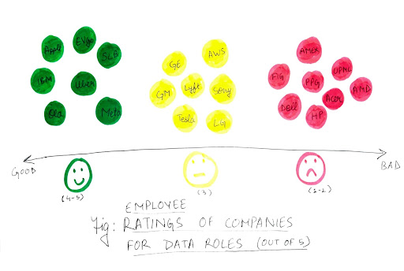

* **Skills Required For Data Science Jobs**

Through this visualization, we will show the most sought-after skills based on industry and what impact those skills have on job prospects and compensation for a job seeker. The multi-select feature will enable the user to interact with the graph and see how adding more skills can improve their chances of getting a high-paying job in their desired sector and the percent increase in the number of jobs they are a good fit for. In the end, the user will have the option to view the job listings they are qualified for.

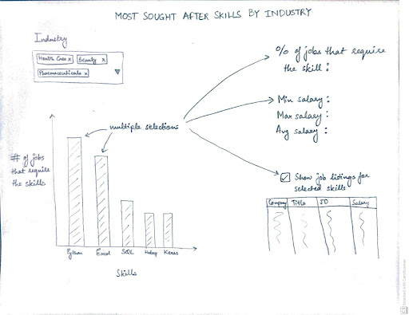

Data Analysis: Sample data to use for visualization

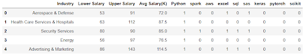

* **Companies with HQ locations**

Job seekers will find it beneficial to move to a city that provides greater exposure to Data Science recruiters giving them good networking opportunities. Apart from job search and exposure, it also opens the door to opportunities such as summits and conferences. These events, usually held in cities where companies have a large presence, are the best place to enrich your network. This visualization is a map that lists the headquarters of organizations in the USA that offer data roles. A filter for the Industry can again be added here to view specific organizations’ headquarters in a particular discipline.

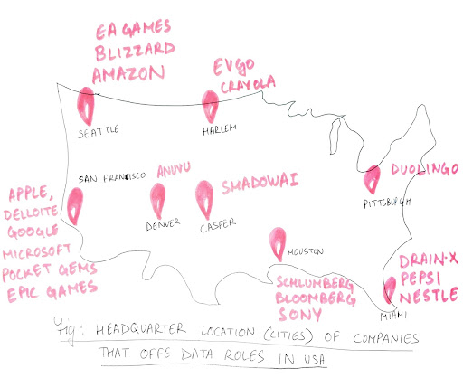

 

**Data Science job recommendation dashboard**

Our recommendation dashboard aims to provide a user to explore data science jobs across the US personalized to his specifications. The user will be able to select his preferred US State, Expected salary range, skills possessed, and preferred industry of work. Based on user inputs, we will display an interactive scatter plot map of the US country/state, highlighting the locations (cities) with available Data Science jobs matching the user's preferences. A tooltip can provide the user with high-level information regarding the city's name, the number of jobs available in the city, and average Glassdoor company ratings for companies in the city.

Apart from the US country/state map, we will display a drop-down with high-level job info of job roles matching the user input preferences. Selecting an entry from the drop-down will show a job summary with data like- Company Name, Industry, Total employees, Job Role, Salary Estimate, etc. 

We will also provide the user an option to upload their resume to check if their resume can match the job description for the role selected. We will display a percentage match score and recommend words to add to their resume to improve their chances of being shortlisted by recruiters at the company.

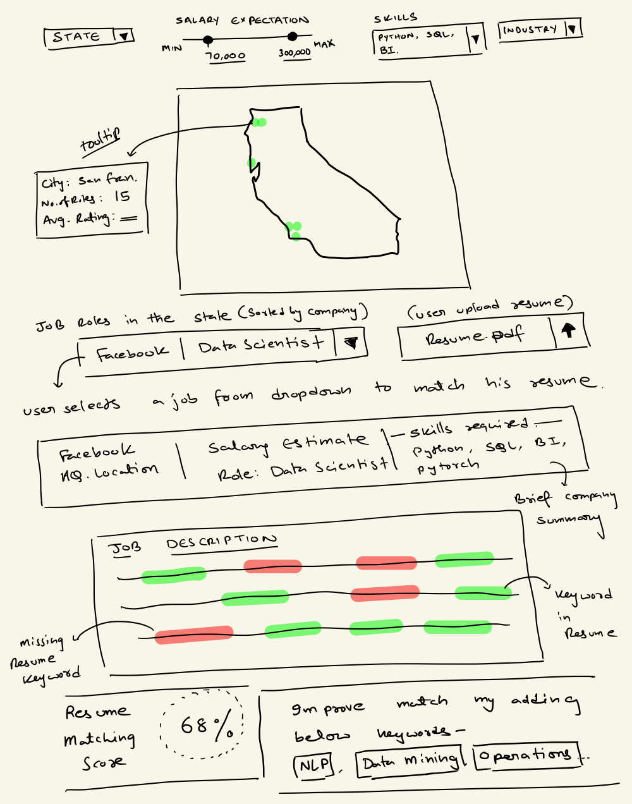

**Data Analysis:**

Job Description extracted from our dataset can be used to extract important key-words and key phrases to observe how they match with contents from the user's uploaded resume.

Key-word extraction using Spacy

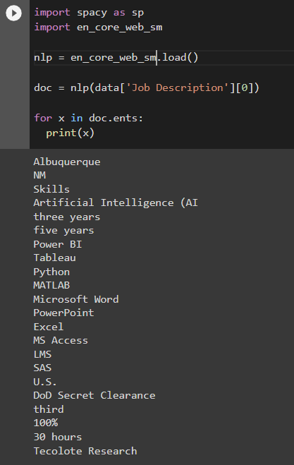

Key-phrase extraction using NLTK

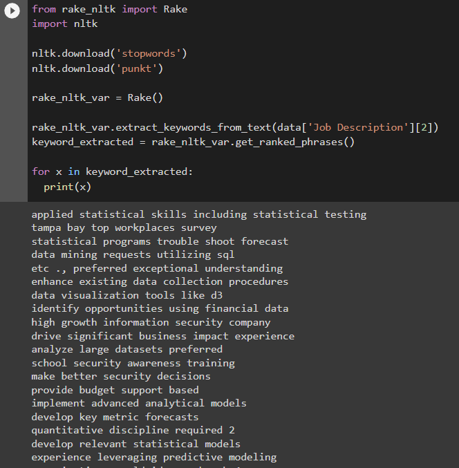