# Final Project Report: Data Science Job Market Visualizer

Project URL: https://share.streamlit.io/cmu-ids-2022/final-project-thescientists/main 

Video URL: https://github.com/CMU-IDS-2022/final-project-thescientists/blob/main/pics/final/final_project_video.mp4

## Introduction

The Data Science profession has seen phenomenal growth in recent years. As data collection and retrieval technologies improve, multiple industries ranging from healthcare to telecommunications have increased the sophistication of their data operations. Now, they are on the lookout for talent capable of processing the mountains of data to gain an edge over their competitors. With so many job opportunities opening up, one is bound to be confused about which role suits their career goals and skill set. 

As college graduates who aspire to be Data Scientists, we would like to understand the Data Science job market deeper than the superficial details provided by news articles and forecasts. Often job seekers apply for Data Science job roles based on information found from online sources and their professional networks. This might result in them losing out on their deserved pay or choosing a job location with a salary that doesn't match the cost of living in the city. We hope to solve this problem by building an interactive dashboard to help Data Science aspirants analyze the U.S. job market and discover roles matching their technical skillset, professional experience, and desired compensation.

To get insights into the extent of data science hiring in the U.S, we analyzed data from the well-known networking and job search portals Glassdoor and Indeed. The datasets we utilized  are created by web scraping:

[Data Analyst Jobs](https://www.kaggle.com/datasets/andrewmvd/data-analyst-jobs)

[Data scientist salary](https://www.kaggle.com/datasets/nikhilbhathi/data-scientist-salary-us-glassdoor)

[Glassdoor Job Postings : Data Science](https://www.kaggle.com/atharvap329/glassdoor-data-science-job-data)

Our dashboard with interactive visualizations would help Data Science aspirants scout the U.S. job market and enable them to find the best job opportunities according to their interests. We have also built a personalized job recommendation feature in our application that can analyze the user's skills, professional experience, location, and salary preferences and suggest roles satisfying their requirements. Furthermore, the job seeker can upload their resume to determine if it's a good match for the job posting. If not, and they are still interested in the position, the application lists keywords that can be added to their resume to pass the ATS check and get an interview. Some of the questions our interactive visualizations will help answer are:

*    Which states and cities have the most Data Science job openings?
*    Differences in salaries between Data Science, Data Engineer, and Data analyst positions.
*    Which industries and companies are actively hiring for data science roles in the U.S.?
*    How do Data Science salaries vary with company size and industry?
*    How do Data Science Salaries compare across locations (cost of living wise)?
*    Which Industries/Companies offer the most lucrative Data Science jobs?
*    What keywords are missing from my resume for this job posting, and how?
*    How can I update my resume to best match the position's needs and increase my chances of getting in?

## Related work

Several popular job search tools like LinkedIn, Glassdoor, ZipRecruiter, etc., have been around for a while. These aggregators boast tools like filtering by skills, location, salary, job type, etc., and also include inbuilt tools for optimization to help match candidates suitable for roles with recruiters and hiring managers. However, these websites are primarily company-oriented and depend on pay-per-click models to make money. In fact, companies can also pay for sponsored posts to reach a larger number of candidates.

While job boards help candidates find jobs, their business model is not made with candidates in mind. And for job seekers, the sheer volume of (often poorly matched) jobs available on these websites, even after filtering, indicates quantity over quality. This can be fixed through niche job boards, which only scrape jobs in specific industries. In the case of data science, several niche job boards such as Built-In, DataJobs, and crunch data have come up over the years.

While these websites are good at crunching job listings, they might not be the best for comparative analysis of jobs across industries and locations, requiring different skill sets and different pay scales before recommending a job. This is what we intend to address through our interactive visualizations. We expect that after using our dashboards, a candidate will get a nuanced understanding of equalized salary statistics across locations and industries, comparison of companies based on employee ratings and salaries, the top skills in demand within industries and companies based on count and average salaries, and finally, job recommendation based on selected salary range, state, and industry. We have also incorporated a resume match functionality for candidates to determine their qualifications for their desired job.

We have built these visualizations using Nikhil Bhathi’s 100+ Insights Data Science Jobs EDA. This is a comprehensive dataset of data science job listings in 2021 with 42 columns, scraped from Glassdoor using Selenium.

## Data Analysis and Choice of Visualizations 

To provide a streamlined flow of information for our application users, we would like to divide our project into three separate visualization dashboards, each covering a topic of interest for a Data Science job hunter.

#### US Data Science Jobs visualizations

The scope of this section is for a Data Scientist to explore the Data Science job market across the US on a country and State level. We were inspired by the fact that Data Science aspirants usually talk about moving to the East or West coast to get the best Data Science roles at respected companies. These country-level visualizations aim to enable job exploration based on the number of Data Science roles available and Salary distribution among various US states. We also provide an interactive Salary Equalizer where a User can find his normalized Salary in multiple States based on the Cost of Living in different States.

For our datasets, we used the Data Science Salaries from Glassdoor 2021 dataset,  Cost of living index dataset from the Missouri Economic Research and Information Center, and US State FIPS codes data to plot geographic Altair choropleth maps.

**Demand for Data Scientists in the United States**

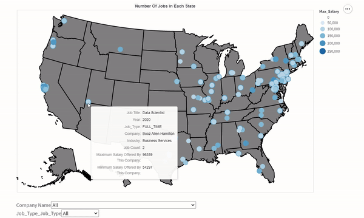

The visualization focuses on the number of jobs available in various states in the United States. Specifically, a potential Data Scientist can explore the locations where his target company of choice is actively hiring. A candidate can also look for what job type is available for different companies and the minimum and maximum salary offered by the company. Each specific location is marked, which shows that the job opportunity is available in that state. 

Once a candidate knows which location is open for the job, they can utilize the ‘United States salary equalizer’ to estimate the cost of living in that particular state. More about the salary equalizer is below sections.

Two dropdown options are available for the USer to search for the company and the job type based on availability.

**Data Scientist Salary Statistics Across the US**

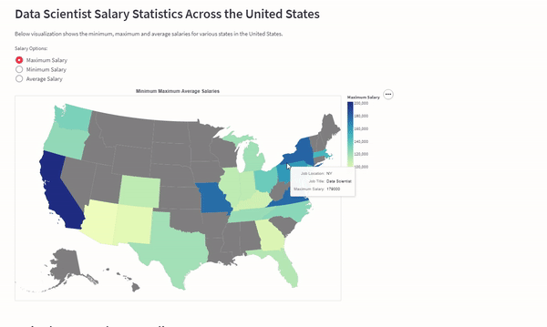

This visualization focuses explicitly on the salary aspect of becoming a Data Scientist in the United States. We wanted potential Data Scientists to have an understanding of what is the minimum, maximum, and average salaries for each state. Our data is limited because Data Science positions are not available in every state. 

There are three radio buttons available-
* Minimum Salary
* Maximum Salary
* Average Salary

Each radio button focuses on the salary option selected. For example, if we choose ‘Minimum Salary’, the color of the map changes, state-wise, depending on which state falls under which Salary category. The state with the least ‘minimum salary’ will be the lightest in color, and the state with the highest ‘minimum salary’ will be the darkest color. 

One interesting observation that we could find was - that the minimum salary for a Data Scientist role in California is lower than the minimum salary of a Data Scientist in New Jersey.

**United States Salary Equalizer**

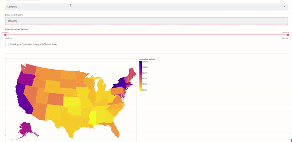
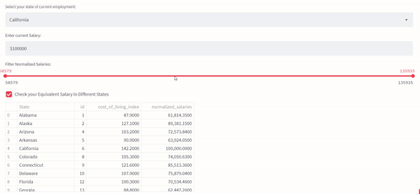

‘Cost of living is the amount of money one needs to sustain a particular lifestyle in a given place. Because the price of goods and services varies from one city to the next, calculating the cost of living will determine how affordable it is to live in a specific area.

We created a tool that can analyze the pay magnitude for the same role across various States in the US. We are taking two inputs from the user - The state where they are currently employed and the current salary in that specific state. 

This visualization can help compare the cost of living in every state by comparing the normalized salaries for each state. For example, A $100,000 salary in California is equivalent to $65,000 in Texas. This can help employees understand their expected pay and negotiate with recruiters when they decide to move to a new location.

#### Industry and Company level visualizations

Job seekers are inclined toward exploring different industries. Especially during the early stage of their career, they seek this kind of exposure to maximize their learning and build a strong foundation for concepts that become the basis of solving problems later in their career. Thus it is imperative to provide industry-specific information on data roles. Five visualizations have been used to emphasize this point:

* Headquarter locations of companies in specific industries
* Salary Distribution for Data Roles in a Specific Industry
* Salary Distribution for Different Companies within a Specific Industry
* Company Ratings within a Specific Industry
* An interactive plot between Company Salaries and Compay Glassdoor ratings

The first visualization is based on the Data Analyst dataset from glassdoor. To plot the locations of headquarters of companies, we extracted the cities from the headquarters column that mentioned the location in a pair of city and state. The next step was to integrate the result with another dataset that provided longitude and latitude values for cities in the US. Data cleaning was done for this dataset to add missing values for specific cities. This chart aims to provide job seeker with insights on what would be a good location for them to maximize their exposure. Typically, companies cluster around certain hotspots, which are the top venues for conferences and other networking events, which can be beneficial for growing one’s professional network. 

The remaining visualizations are based on the Data Scientist Salaries 2021 dataset from Glassdoor. The simplified job roles column was normalized to categorize all roles under three fundamental categories: data scientist, data analyst, and data engineer. Next, the Salary Estimate column was cleaned to remove irregular text and retain the minimum and maximum salaries. Next, the Glassdoor Rating for the company was encoded into a nominal variable as follows:

1. Good: Employee ratings between 3.6-5 on a scale of 5
1. OK: Employee ratings between 2.5-3.6 on a scale of 5
1. Bad: Employee ratings between 0-2.5 on a scale of 5

The intuition behind this was an equal partition for the extremes (i.e., good and bad) and a standard middle range for average. This provides some room to account for differences in opinion with the same underlying connotation (for instance, the employee may have a few complaints, but when asked to provide an overall review in one word, they may say ‘good enough’ ~ 3.6).

A drop-down menu lists the various industries. The job seeker can select a particular industry to view the rest of the charts. Checkboxes are provided to toggle the chart view and avoid extensive scrolling. The first chart shows the salary distribution for the three data roles within the selected industry. We observed that data scientists get paid the most in most industries.

A bubble chart drills down further to view salaries by companies. Each bubble represents a salary for a given data role in a company. The size and color of bubbles in our plot are encoded to wages offered. These two visual cues are used in this case to emphasize the point (or difference in salaries) to the viewer. The legend provides an idea of the degree of shading instead of giving an exhaustive list for a quantitative field. There were no companies that offered 50-100K, so the bubbles for those appear blank in the legend.

The following chart is a bubble plot that displays company ratings. These can range from good, ok to bad, based on the score employees provided on a 5-point scale. A green bubble depicts the good, ok by yellow, and bad in red. Furthermore, upon hover, the tooltip that appears includes the average salary offered to provide a complete idea. We find that hardly any company is rated poorly (bad) in the dataset.

Lastly, a combination of the two bubble charts constitutes the final visualization. The viewer may choose a selection area in the salary distribution chart on the left. The company rating chart on the right, changes in real-time to display the ratings for the selected companies. Job seekers can thus, utilize this as a tool to gauge if a highly paying organization has a good culture. This can also be used to make trade-offs to decide on a job offer with a low compensation vs well-rated company reviews and prospects of growth – something especially relevant for internships.

Through simple interactions, these charts can provide key information about salary within factors such as industry and company rating. Undoubtedly, one of the main factors that make a job offer competitive is salary. At the same time, aspects such as prospective growth, organizational culture, and learning opportunities also shape a candidate’s decision. This dashboard section helps make this decision easier than only considering monetary compensation.

**Skill Demand by Industry**

While there is no shortage of employment websites, we noticed that hard skills were only listed in individual job descriptions, and some filters and otherwise were not the highlight of these web pages. To address this, we decided to make a visualization that centers on the importance of skills in every industry so that a job seeker can be better informed about the industry’s perspective when hiring and upskill accordingly.

Therefore, our main chart in this visualization is the most sought-after skills, filtered by industry and ordered by job count. It also displays the mean, maximum and minimum salary averages in the selected industry/sector and can be screened for multiple skills.

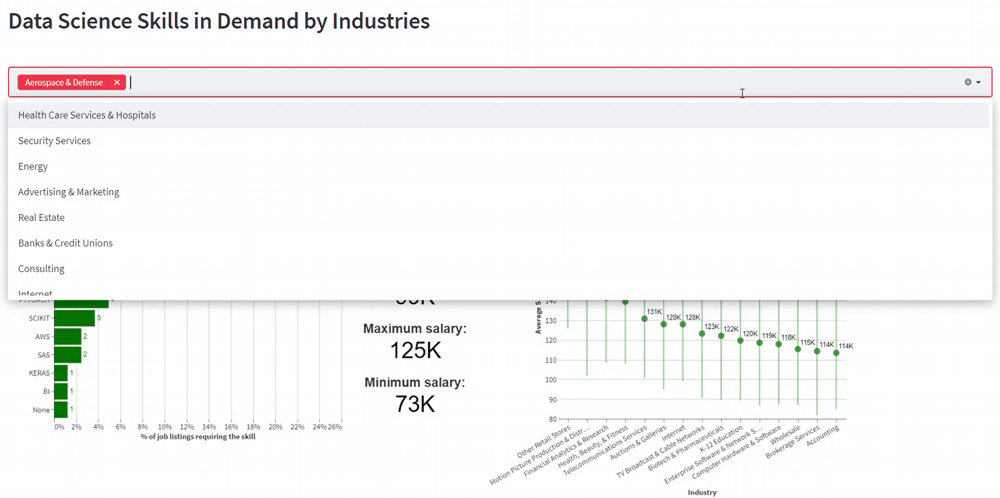

In addition to providing a summary of salary statistics across the selected industries, the user can view the chart on the right to see the top 15 industries for said skill by average salary. This gives an excellent comparison to the user, as the same skill may be valued differently across industries, which reflects in the number of jobs that require the skill and the pay scale for said jobs.

An interesting observation this visualization enabled us to make is shown in the GIF below: 

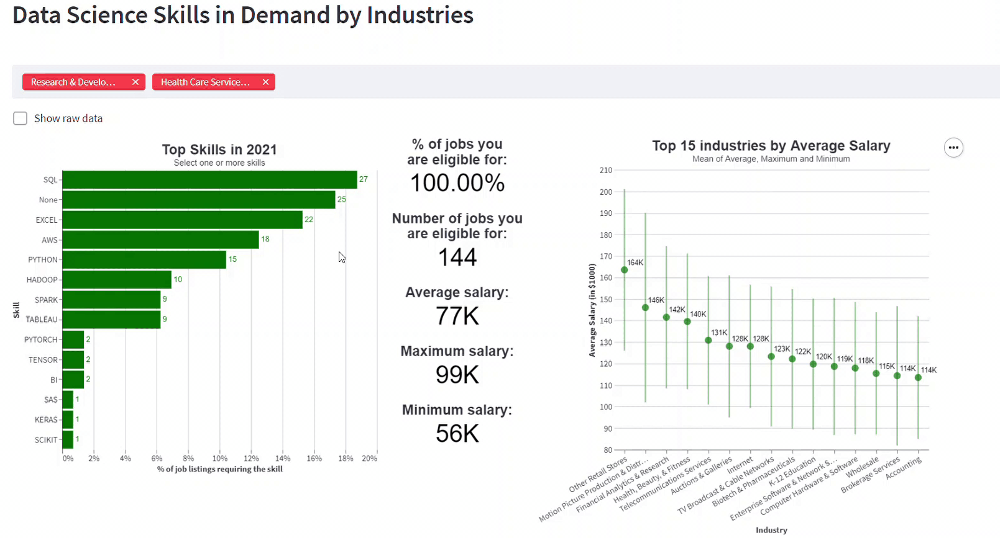

The top data science skill by job count in Aerospace and Defense and HealthCare Services is SQL, and the average salary for jobs that offer the same is $87,000. In contrast, the Health, Beauty & Fitness industry has an average salary of $140,000 and a maximum salary of $171,000, which is much higher than selected industries. However, the tooltip shows that it only has a single job listing with said salary than 27 job listings in the selected industries. This will help job seekers monetarily measure how lucrative their skills are and where.

The visualization also has the job listings, in descending order of average salaries, once again filtered by skill:

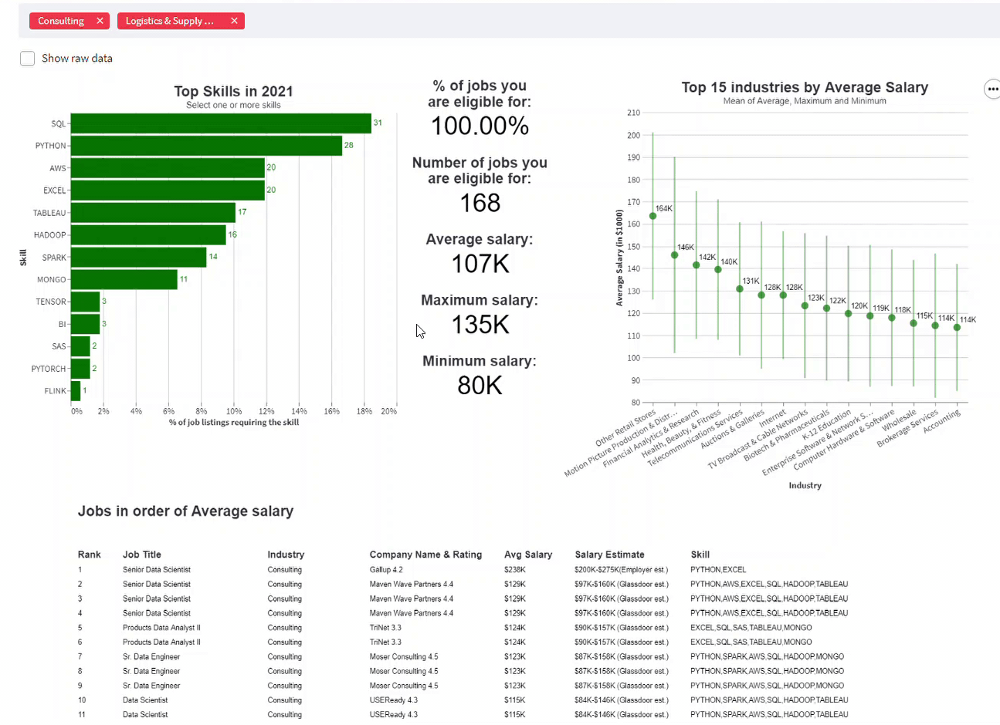

As seen in the above GIF, another interesting observation is that of the jobs requiring Mongo; the job listing ranked 10 has a lower average and minimum salary than the one ranked nine but has a higher maximum salary. It also requires fewer skills of the applicant than the one ranked 9. This means that a job seeker can negotiate for higher pay for a job with fewer skills!

By making the skills front and center, we plan to make it easier to bridge the gap in desired skills between the industry and employment seeker to make it easier to understand the requirements of a job market, and enable the user to compare across industries and companies to arrive at a decision based on where they can find more opportunities, and feel more valued.

_Data Analysis:_ We used data wrangling to filter and plot the desired values in this visualization. Each listed skill has a column of its own in the dataset with boolean entries indicating whether the job listing requires the skill. We used pandas melt to flatten the data frame to plot the top 15 industries and the top job listings for each skill. Finally, we used mark_text to show the metrics and listings combined with transform_lookup and transform_window and error bars to plot the salary statistics in Altair, all linked to the main bar chart.

#### Data Science job recommendation dashboard

After analyzing data on the best States and cities to work in and getting a clear idea of the industries and companies to prefer, We would like to guide our User to apply for Data Science roles where he would be a good fit. This can be accomplished by providing the User with a filtered list of job roles that satisfy the User's preferences. Based on the features available in our dataset, We decided to include the below variables for users to filter job roles available in the US:

_Preferred US State to Work from:_ 
A user's choice of State can depend on many factors, like- family, weather, State and Local Taxes, company location across the US, etc. This option provided the User the ability to localize his search significantly.

_Expected Salary Range:_
After analyzing the 'United States Salary Equalizer', which normalizes the salaries across US states based on the Cost of Living Index, The User can make an informed expectation on the salary range in his preferred US State. 

_User's Skills:_
The salary of a Data Scientist can vary widely based on their proficiency in tools and techniques to analyze and build analytic models from data. The User can filter job roles that prefer applicants based on their skills, and the filtered results can help the user gauge the strength of his profile based on the skills he is proficient in. For example, a user only proficient in SQL might have access to limited opportunities compared to someone skilled in Python.

_Industry/Sector of Work:_
A Data Science aspirant's preferred work industry/sector is an essential indicator of job satisfaction. Since Data Science is a multidisciplinary field, it will provide the User a considerable advantage in finding jobs in the industry/sector where they possess prior domain expertise.

User input selections for the above parameters are used to filter our dataset and get a list of job roles that satisfy the User's preferred State, Expected Salary Range, Skills, and Industry. After obtaining the filtered dataset, we further aim to guide the User to filter down available job roles from the State level to the City level. To achieve this, we implement a scatter plot of coordinate points of job roles available in the cities on the backdrop of the User's preferred State. We further support this geographic plot by summarizing the spread of salaries for Data Science roles within each of these cities. This is implemented using a grouped error-bar chart where the points represent the Average Salary of job roles in each city. 

For below example, when the User selects the State of Florida, along with other filters for his expected Salary range, Skills and Industry, We see that there are multiple job roles available in Cities across Florida from our geographic scatter plot of the state map. Complementing this map, we provide a Salary summary of Data Science roles in the State using an error-bar plot that shows that Orlando has the highest Data Science Salaries compared to other cities in Florida. Thus, we have helped our users narrow down these options from the US level to the State level to the City level. Next, the User has to study the companies and the job descriptions of roles. 

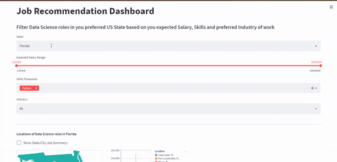

For the next phase of the Dashboard we focus on providing the user feedback base don his job selection. First we give the User a simplified dropdown where they observe a simple summary (consisting on the Role name, Company and City) for each role available in the User's preferred State. The selection of an option from the dropdown displays a summary of the company and the role offered. For example, When the below User chooses ......... They can view detaisl of the company, glassdoor employee rating, headquarters location, Industry/sector, available role name, estimated salary, job location. We also provide an expandable container for viewing the job description. 

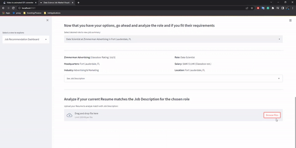

The User can now upload their Resume to receive a match score between their Resume and the job description provided by the company. The User uploads their Resume in PDF format of their Resume, and this is parsed using the PDFPlumber python library to extract text from the PDF. Next, we parse the job description to get keywords from the job description that can contain- Tools, Skills, and words important in the context of the job description. We investigated two approaches for keyword extraction- Using Spacy NLP library and EMSI Skill Extraction API. We observed that output from Spacy is not robust in extracting words belonging to skills, tools, and job requirements for a Data Scientist. EMSI API, on the other hand, can extract only Skills (including Specialized and standard tools and technologies) used throughout the Job Industry. Below is a comparison of Keywords extracted using Spacy and EMSI Skill Extraction API.

Resume Match run on EMSI API extracted keywords:
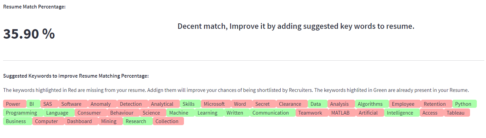

Resume Match run on Spacy Language Model keywords:
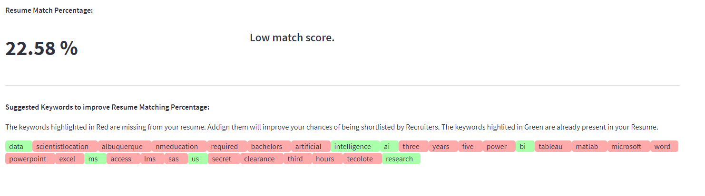
 
Observing the results from both approaches, using the EMSI API for Skill Extraction from job description works more robustly than keyword extraction using Spacy's language model. After obtaining the keywords from the job description, we do a simple String matching to find keywords existing in the parsed text from the User's Resume PDF document. So the output of our String matching approach calculates the number of keywords existing in the uploaded Resume divided by the total number of extracted keywords. This result is displayed to the User and complemented with feedback that categorizes the match as Good, decent, and low. We also display the keywords extracted from the job description, annotated in Green and Red highlights. Green highlighted keywords refer to keywords found in the User's Resume. In contrast, the Red highlighted keywords are those missing from the User's Resume but are skills that the company will be looking for in a potential Data Science hire. Our Keyword visualizer is intended to help the User modify their Resume to contain keywords extracted from the job description to maximize their probability of being noticed by recruiters.

## Future Work

We believe that our interactive visualizations can help prospective Data Scientists and those looking to move industries, companies, or States for better Data Science opportunities in the US. But there is also plenty of scope for improving the existing dashboard.

First, The primary dataset used for giving shape to our visualizations was web scraped from the Glassdoor website in 2021. We had initially searched for an open-access API to get job posting data from any of the major job search websites like- Glassdoor, LinkedIn, and Indeed. But APIs to these sites were only available for commercial use or not for public service. Integrating an API can help provide us with a richer dataset that can offer us more data variables to make content-rich visualizations. Also integrating a real-time or near real-time API will make a good addition to our Job Recommendation Dashboard, where Users can use up-to-date job postings data to make better-informed decisions.

Another improvement that can make our dashboard more meaningful is improving the Resume Matching Algorithm and Keyword Extraction Algorithm. For the keyword extraction, we compared two approaches. The Spacy Language Model, which is open source, and EMSI Skills API, which is not open access but uses power NLP to extract all skills the job description contains. We believe that given sufficient time we could have improved our use of the Spacy Language Model better by tuning the model's parameters to improve keyword extraction. For the Resume Matching Algorithm, we have currently only implemented a one-to-one String matching approach. The keywords from the job description and the text from the User's resume can be lemmatized to improve the matching score algorithm, which currently fails to account for the base form of words. 

We believie that this tool has the potential to help Data Scientists make informed decisions and can be extended to include other job roles like Software Developers, Product Managers, etc. Our tool can also be integrated with job search portals like- Glassdoor, Indeed and LinkedIn and can improve a User's job search process by helping them make informed decisions.

## References

1. [Abrosimova, K. (2021, October 12). How Can You Build and Monetize a Job Aggregator? 7 Business Models Beyond PPC. Steelkiwi.](https://steelkiwi.com/blog/how-can-you-build-and-monetize-a-job-aggregator-7-business-models-beyond-ppc/)
1. [Colson, C. (2022, April 4). Data Science Job Boards Roundup. Dataspace.](https://dataspace.com/data-job-seekers/data-science-job-boards/)
1. [United States state FIPS codes](https://www.nrcs.usda.gov/wps/portal/nrcs/detail/?cid=nrcs143_013696)
1. [Maps in Altair (colored based on variables)](https://firas.moosvi.com/courses/2020_WT2/data551/class/4-maps-deployment.html)
1. [Choropleth graph](https://altair-viz.github.io/gallery/choropleth.html)
1. [Map references in Altair](https://colab.research.google.com/github/altair-viz/altair-tutorial/blob/master/notebooks/09-Geographic-plots.ipynb)
1. [Cost of Living Index](https://meric.mo.gov/data/cost-living-data-series)
1. [EMSI Skills API](https://skills.emsidata.com/)
1. [Keyword extraction in Python with NLP](https://towardsdatascience.com/keyword-extraction-process-in-python-with-natural-language-processing-nlp-d769a9069d5c)
